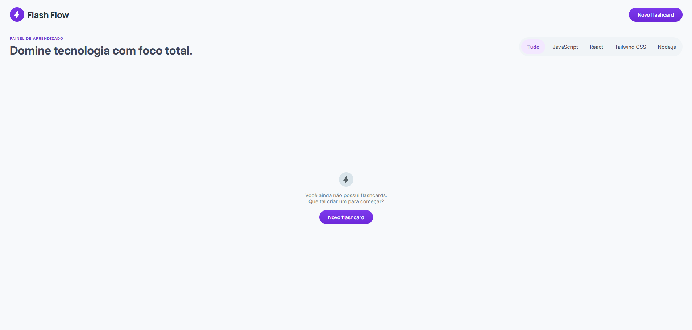

# 📚 FlashFlow 2.0

Aplicação Full Stack para gerenciamento de flashcards de estudo, desenvolvida com React, TypeScript, Node.js, Express e SQLite.

O sistema permite criar, editar, remover e revisar flashcards organizados por categorias, facilitando o estudo e a revisão de conteúdos através da técnica de repetição ativa.



---

# 🚀 Funcionalidades

## Front-end

* Criar flashcards
* Editar flashcards existentes
* Excluir flashcards com confirmação
* Listar todos os flashcards cadastrados
* Filtrar flashcards por categoria
* Visualizar perguntas e respostas através do flip do card
* Interface responsiva
* Integração com a API do back-end

## Back-end

* Cadastro de flashcards
* Consulta de flashcards
* Atualização de flashcards
* Remoção de flashcards
* Validação de campos obrigatórios
* Categorias pré-definidas
* Retorno de dados em formato JSON
* Persistência utilizando SQLite

---

# 🛠️ Tecnologias Utilizadas

## Front-end

* React
* TypeScript
* Vite
* CSS Modules

## Back-end

* Node.js
* Express
* TypeScript
* SQLite
* CORS
* dotenv

---

# 📂 Estrutura do Projeto

```txt
flashflow2.0
│
├── web
│   ├── src
│   │   ├── assets
│   │   ├── components
│   │   │   ├── Button
│   │   │   ├── Filter
│   │   │   ├── Flashcard
│   │   │   ├── FlashcardForm
│   │   │   ├── FlashcardModal
│   │   │   ├── Modal
│   │   │   └── NewFlashcardButton
│   │   ├── services
│   │   ├── types
│   │   ├── App.tsx
│   │   └── main.tsx
│   │
│   └── package.json
│
├── server
│   ├── src
│   │   ├── controllers
│   │   ├── database
│   │   ├── models
│   │   ├── routes
│   │   ├── utils
│   │   └── server.ts
│   │
│   ├── package.json
│   └── .env.example
│
└── README.md
```

---

# ⚙️ Configuração do Ambiente

## Instalar dependências

### Front-end

```bash
cd web
npm install
```

### Back-end

```bash
cd ../server
npm install
```

---

# 🔐 Variáveis de Ambiente

## Back-end

Crie um arquivo `.env` baseado no arquivo `.env.example`.

Exemplo:

```env
PORT=3000
DATABASE_URL=./database.sqlite
```

## Front-end

Crie um arquivo `.env` dentro da pasta `web`.

Exemplo:

```env
VITE_API_URL=http://localhost:3000
```

---

# ▶️ Executando o Projeto

## Iniciar o Back-end

```bash
cd server
npm run dev
```

## Iniciar o Front-end

Em outro terminal:

```bash
cd web
npm run dev
```

---

# 🌐 Acesso

Após iniciar os serviços:

### Front-end

```txt
http://localhost:5173
```

### API

```txt
http://localhost:3000/flashcards
```

---

# 📖 Fluxo da Aplicação

```txt
Usuário
   ↓
Interface React
   ↓
API (fetch)
   ↓
Node.js + Express
   ↓
SQLite
   ↓
Resposta JSON
   ↓
Atualização da Interface
```

---

# 🎯 Conceitos Utilizados

* Componentização com React
* Gerenciamento de estado com Hooks
* Comunicação entre Front-end e Back-end
* Operações CRUD
* Consumo de APIs REST
* Organização de código por responsabilidades
* Persistência de dados com SQLite

---

# 👨‍💻 Autor

**Gustavo Menacho de Almeida**

Projeto desenvolvido para fins acadêmicos e prática de desenvolvimento Full Stack.
